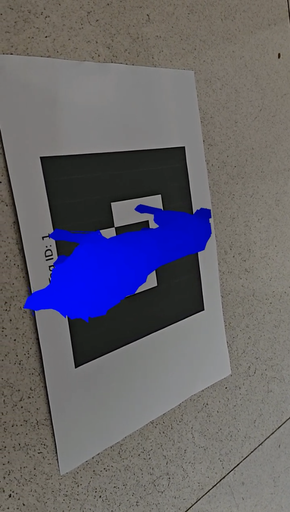

# AR-From-Scratch 🧱📐  
**An end-to-end Augmented Reality pipeline built entirely from first principles**

---

## Overview

This project implements a complete **Augmented Reality (AR) pipeline** for detecting custom fiducial AR tags, estimating their pose, and performing real-time 2D and 3D augmentations on video streams.

All **core computer vision components** — including filtering, thresholding, contour detection, homography estimation, inverse warping, tag decoding, and projection — are implemented **from scratch**, without using OpenCV’s high-level vision functions.

> **No `cv2.findHomography`  
> No `cv2.warpPerspective`  
> No black boxes.**

Only basic OpenCV utilities are used for **video capture and display**.

---

## Features

### ✅ AR Tag Detection & Identification
- Robust detection of custom **8×8 fiducial AR tags**
- Perspective correction using **self-implemented homography**
- Orientation estimation using anchor-cell detection
- Binary ID decoding from the inner 2×2 grid
- Support for **multiple tags per frame**

### ✅ 2D Augmented Reality
- Accurate template overlay using **inverse homography**
- Orientation-aware alignment
- Smooth rendering under perspective distortion

### ✅ 3D Augmented Reality
- Projection of 3D `.obj` models onto detected tags
- Camera pose recovery from homography
- Proper scaling, centering, and orientation matching
- Flicker reduction using temporal stability checks

### ✅ Performance Evaluation
- Real-time FPS monitoring
- Detection rate tracking
- Jitter analysis for temporal stability

---

## Repository Structure

```

.
├── main.py            # Entry point (video/webcam loop)
├── utils.py           # AR pipeline, tag decoding, rendering, helpers
├── cv2_functions.py   # Custom re-implementation of OpenCV functions
├── evaluate.py        # FPS, detection rate, and jitter evaluation

````

---

## From-Scratch Implementations

All of the following are **manually implemented** in `cv2_functions.py`:

- Grayscale conversion
- Box filter & Gaussian blur
- Adaptive thresholding (mean & Gaussian)
- Otsu & temporal thresholding
- Contour detection
- Polygon approximation
- Convexity checks
- Image moments
- Homography estimation
- Perspective warping (inverse mapping + bilinear interpolation)
- Sobel edge detection
- Image resizing
- Point perspective transformation

This ensures full control over numerical stability, performance, and algorithmic behavior.

---

## Usage

> Read setup.md

---

## Output

The system displays:



* Detected tag boundaries
* Tag ID and orientation
* Live FPS and detection rate
* Final performance report with average jitter

---

## Design Philosophy

This project was built with the goal of **understanding computer vision at its core** rather than relying on library abstractions.

Every transformation, threshold, and projection is explicitly coded to reflect the underlying mathematics of:

* Projective geometry
* Homogeneous coordinates
* Camera models
* Image sampling and interpolation

---

## Notes

* OpenCV is used **only** for:

  * Video input/output
  * Display utilities
* All vision logic strictly follows assignment constraints.
* Designed to be robust against viewpoint changes and perspective distortion.

---

## Acknowledgements

Developed as part of
**COL7680 / JRL7680 / COL780 – Introduction to Computer Vision**
Indian Institute of Technology Delhi

---
